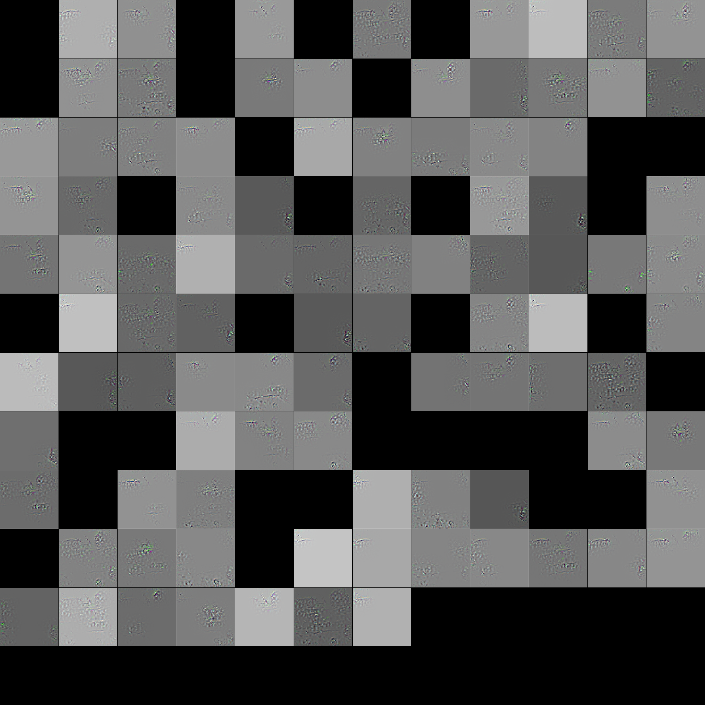

# Feature Map Comparison between Rain/No rain image

|   |   | 
| :-----------: | :-----------: | 
|  |  | 

Inverted Rain image (No.115) by last max pooling output of AlexNet.

|   |   | 
| :-----------: | :-----------: | 
|  |  | 

Inverted No Rain image (No.115) by last max pooling output of AlexNet.

|   |   | 
| :-----------: | :-----------: | 
|  |  | 

Inverted Rain image (No.480) by last max pooling output of AlexNet.

|   |   | 
| :-----------: | :-----------: | 
|  |  | 

Inverted No Rain image (No.480) by last max pooling output of AlexNet.
